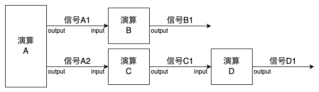
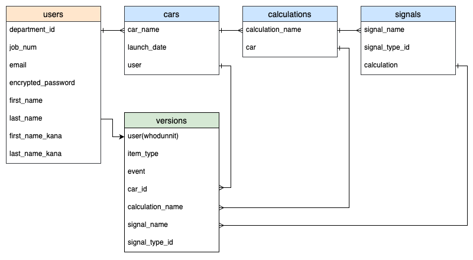

# TraceApp  

## アプリケーション概要
  車載システムにおいて、演算を変更した際に影響範囲を自動的に抽出するアプリ  

## アプリケーションを作成した背景
  車載システムでは、演算間で信号の入出力を繰り返すことで、目的の機能を実現している。  
  そのため、1つの演算を変更すると複数の演算や信号に影響する可能性がある。

  *図1：車載システムにおける演算の流れ*
  

  従来は人が手作業で影響範囲を確認していたが、演算数は数千単位に及び、網羅的な確認には膨大な工数がかかっていた。  
  そこで、演算と信号の関係をテーブル化し、影響範囲を自動抽出できるアプリを開発した。

## URL

## テスト用アカウント
- Basic認証ID：trace
- Basic認証パスワード：2222
- メールアドレス：trace@example.com
- パスワード：1111aA

## 利用方法
### 1. 車両/演算/信号の登録
1. トップページ（車両一覧ページ）のヘッダーからユーザー新規登録を行う
2. トップページの「新規登録」ボタンから車両の登録を行う
3. トップページのボディから登録した車両の名称をクリックし、車両詳細ページに遷移する
4. 車両詳細ページから演算の登録を行う
5. 車両詳細ページから信号の登録を行う

### 2. 車両/演算/信号の編集および削除
1. 車両詳細ページにおいて、「車両の編集」「演算の編集」「信号の編集」の各ボタンから車両/演算/信号の編集を行う
2. 車両詳細ページにおいて、「車両の削除」「演算の削除」「信号の削除」の各ボタンから車両/演算/信号の削除を行う

### 3. 変更履歴の確認
1. 車両詳細ページにおいて、「変更履歴」のボタンから変更履歴を確認する

### 4. 影響範囲の確認
1. 車両詳細ページにおいて、変更する演算における「信号の追跡」ボタンから、影響を受ける演算および信号を確認する

## 実装した機能とGIF
### 1. モーダルによる登録・編集
モーダルで車両/演算/信号の登録や編集を行う  
*モーダル操作の例：*

### 2. 変更履歴の確認
過去の変更履歴を一覧で確認できる  
*変更履歴の確認の例：*  

### 3. 影響範囲の確認
演算を変更した際に、影響を受ける演算および信号を自動的に抽出する  
*影響範囲の確認の例：*  

## データベース設計

## 画面遷移図

## 開発環境
- フロントエンド：HTML, CSS, JavaScript
- バックエンド：Ruby on Rails
- データベース：MySQL
- インフラ：Render
- テスト：Rspec
- テキストエディタ：VScode
- タスク管理：GitHub Projects

## ローカルでの動作方法
以下のコマンドを順に実行する。  
% git clone 
% cd trace-42193  
% bundle install  
% rails db:create  
% rails db:migrate  
% rails s 

## 工夫したポイント
- モーダルで登録・編集・削除の操作を完結させ、ユーザー体験を向上させた点
- 変更履歴を保持し、確認機能を実装することで、保守性を向上させた点

## 制作時間
- 期間：3週間  
- 実働：40時間